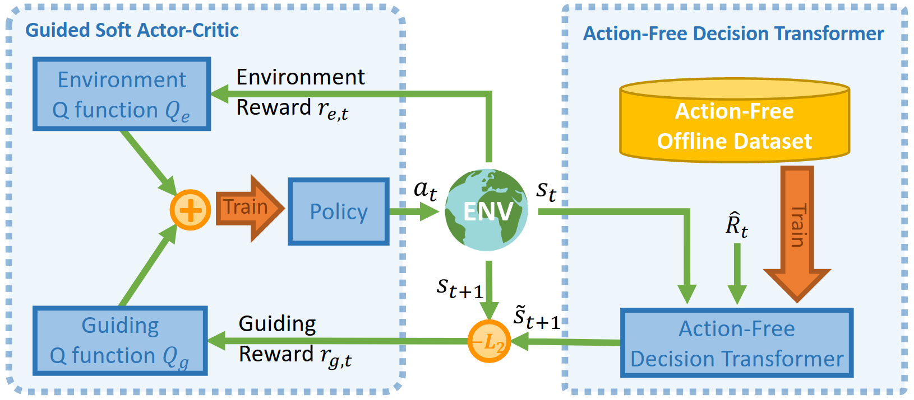

# Action Free Guidance


Repository of AF-Guide [Guiding Online Reinforcement Learning with Action-Free Offline Pretraining](https://arxiv.org/abs/2301.12876). 



## Installation

```bash
conda env create -f environment.yml
conda activate afguide
```


## Guided SAC Training


Training Guided-SAC using pretrained AFDT.
```bash
# specify different environments by changing the config files
python scripts/train_guided_sac.py  --config configs/guided_sac/hopper_medium.yaml --device="cuda"  --ckpt_root /path/to/save/model/  --name_postfix test --seed 0
```

Training SAC with additional guiding rewards from pretrained AFDT.
```bash
# specify different environments by changing the config files
python scripts/train_guided_sac.py  --ablation_sac_reward_sum  --config configs/guided_sac/hopper_medium.yaml --device="cuda"  --ckpt_root /path/to/save/model/  --name_postfix test --seed 0
```

Training pure SAC without guidance from action-free offline dataset.
```bash
# specify different environments by changing the config files
python scripts/train_guided_sac.py  --config configs/sac/hopper_medium.yaml --device="cuda"  --ckpt_root /path/to/save/model/  --name_postfix test --seed 0
```


## AFDT Training

Download dataset first 
```bash
python scripts/download_datasets_afdt.py
```

Train AFDT
```bash
python scripts/train_afdt.py --env antmaze-umaze-v0  # change to the dataset you want
```

## References
```
@article{zhu2023guiding,
  title={Guiding Online Reinforcement Learning with Action-Free Offline Pretraining},
  author={Zhu, Deyao and Wang, Yuhui and Schmidhuber, J{\"u}rgen and Elhoseiny, Mohamed},
  journal={arXiv preprint arXiv:2301.12876},
  year={2023}
}
```
